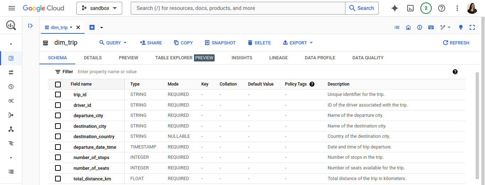
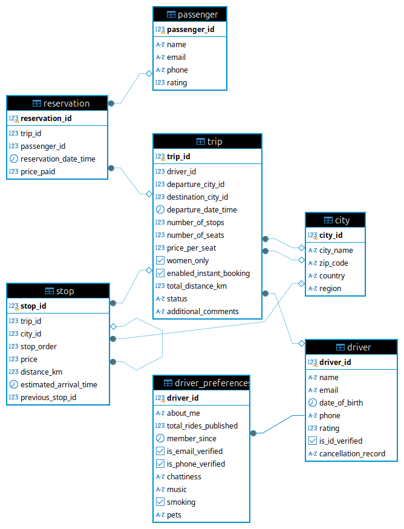

# BlablaCar Case Study

## Overview

This project leverages the Faker library to create an OTLP (Online Transaction Processing) database for BlablaCar, a carpooling service. The generated transactional data will later be analyzed using Google BigQuery.

## Getting Started

### Prerequisites

Ensure you have Python 3.10 or later installed along with PostgreSQL and Google Cloud SDK.

### Setup

1. **Create a Virtual Environment**
```bash
python3.10 -m venv ~/carpool-system
source ~/carpool-system/bin/activate
pip install -r requirements.txt
```

2. **Start Your PostgreSQL Instance**
```bash
sudo systemctl status postgresql
sudo systemctl start postgresql
```

3. **Connect to PostgreSQL as the Default User**
```bash
sudo -i -u postgres
psql
```

4. **Create Database and User with Permissions**
```bash
CREATE USER blablacar WITH PASSWORD 'adminblablacar';
CREATE DATABASE blablacar_engine;
GRANT USAGE, CREATE ON SCHEMA public TO blablacar;
ALTER ROLE blablacar SET timezone TO 'UTC';
GRANT ALL PRIVILEGES ON DATABASE blablacar_engine TO blablacar;
ALTER USER blablacar WITH SUPERUSER;
```

Note: If you encounter "Peer authentication failed for user blablacar", modify the PostgreSQL authentication method:
```bash
sudo nano /etc/postgresql/16/main/pg_hba.conf
local   all             all                                     md5 # change this line (change peer to md5)
sudo systemctl restart postgresql # restart your postgres instance
```

5. **Connect to PostgreSQL with Your New User**
```bash
psql -U blablacar -d blablacar_engine
```


## Enable bigquery Project

Authenticate
```bash
gcloud init
```

Enable billing
```bash
gcloud auth application-default login
```


## Some considerations

- Your working directory or Python path should be ${workspaceFolder}/src.
- All the trips created were generated within the same country for simplicity.


# Resolved Challenges

### 1. Analytics Data Model

As a Data Engineer, I was asked to build an Analytics data model for the given use case. The main stakeholders are data analysts and business analysts. Below is the description of the data model.

#### a. Analytics data model



The image above illustrates how the `dim_trip` table is represented in Google BigQuery, complete with descriptions for each column. This will assist users in navigating the data and understanding the context of each field.


#### b. Documentation for OLAP Process Model
The OLAP model is derived from the OLTP model and is specifically optimized for analytical processing. In this model, tables are strategically partitioned and clustered to significantly enhance query performance. Below is the Entity-Relationship Diagram (ERD) illustrating the original OLTP schema.



All the SQL queries for creating the tables can be found in the following directory:
```bash
/carpool-system/src/infrastructure/ddl/create_oltp_ddls.sql
```


And the queries to create the OLAP:
```bash
/carpool-system/src/infrastructure/ddl/create_olap_ddls.sql
```


### Tables in the OLAP Datawharehouse:

#### Fact Tables:
- **fact_reservation**: 
  - Contains details about reservations made for trips, linking each reservation to a specific trip and passenger.

#### Dimension Tables:
- **dim_trip**: 
  - Stores comprehensive information about trips, including trip ID, driver ID, departure city, destination city, destination country, departure date and time, number of stops, number of seats, and total distance.

- **dim_driver**: 
  - Contains details about drivers, including driver ID, name, verification status, rating, total rides published, and membership date.

- **dim_passenger**: 
  - Stores information about passengers, including passenger ID, name, and rating.

- **dim_city**: 
  - Contains information about cities relevant to trips.

### Partitioning/Clustering:
- The `fact_reservation` table is partitioned by `reservation_date_time` and clustered by `trip_id` and `passenger_id` to facilitate efficient querying.
- The `dim_trip` table is partitioned by `departure_date_time` and clustered by `trip_id` and `driver_id` to improve performance for trip-related analyses.

### 2. Documentation for OLAP Model

This section is intended for data analysts who wish to explore and query the data effectively.

**Table Descriptions:**
- **fact_reservation**:
  - **Columns**: `reservation_id`, `trip_id`, `passenger_id`, `reservation_date_time`, `price_paid`
  - **Relationships**:
    - Foreign key to `dim_trip`
    - Foreign key to `dim_passenger`

- **dim_trip**:
  - **Columns**: `trip_id`, `driver_id`, `departure_city`, `destination_city`, `destination_country`, `departure_date_time`, `number_of_stops`, `number_of_seats`, `total_distance_km`
  - **Relationships**: 
    - Foreign key to `dim_driver`
    - Foreign key to `dim_city`

- **dim_driver**:
  - **Columns**: `driver_id`, `name`, `is_id_verified`, `rating`, `total_rides_published`, `member_since`
  
- **dim_passenger**:
  - **Columns**: `passenger_id`, `name`, `rating`
  
- **dim_city**:
  - **Columns**: *(Include the columns for this table if available.)*


### 3. Example Queries

Below are some example SQL queries that data analysts can use to explore the data:

#### i. How many trip offers have been published last month?
```sql
SELECT
    DATE_TRUNC(DATE(departure_date_time), MONTH) AS date,
    COUNT(trip_id) as trips_count,
    SUM(total_distance_km) total_km
FROM `develop-431503.carpool_engine.dim_trip`
WHERE departure_date_time >= TIMESTAMP(DATE_TRUNC(DATE_SUB(CURRENT_DATE(), INTERVAL 1 MONTH), MONTH))
  AND departure_date_time < TIMESTAMP(DATE_TRUNC(CURRENT_DATE(), MONTH))
GROUP BY 1
```


#### ii. What country had the highest number of publications last mont?
```sql
WITH target_data AS 
(SELECT 
    DATE(DATE_TRUNC(r.reservation_date_time,MONTH)) AS date,
    r.trip_id,
    t.destination_country as country,
    r.price_paid
FROM `develop-431503.carpool_engine.fact_reservation`  r   
JOIN `develop-431503.carpool_engine.dim_trip` t using (trip_id)  
)

SELECT
   date,
   country,
   sum(price_paid) earnings,
   count(trip_id) as trips
from target_data
GROUP BY 1,2 
ORDER BY 1 DESC
```

## Dashboard Link

You can view the data insights and reports on the [Dashboard](https://lookerstudio.google.com/reporting/e883cbd5-5c1c-4bfa-b7a6-e3df05ae48fa).


